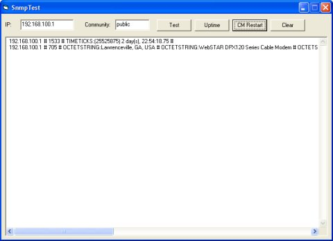



## AAA SNMP OCX

### Description

SNMP v1 ActiveX, support: GET, GETNEXT, SET

Keywords: SNMP, "Simple Network Management Protocol", RFC 1157, MIB, OID, UDP, UDP/IP, SNMP Packet
 
### More Info
 

             |
---                |---
**Submitted On**   |2006-05-28 12:37:24
**By**             |[Petr Domorazek](https://github.com/Planet-Source-Code/PSCIndex/blob/master/ByAuthor/petr-domorazek.md)
**Level**          |Advanced
**User Rating**    |4.8 (29 globes from 6 users)
**Compatibility**  |VB 6\.0
**Category**       |[Internet/ HTML](https://github.com/Planet-Source-Code/PSCIndex/blob/master/ByCategory/internet-html__1-34.md)
**World**          |[Visual Basic](https://github.com/Planet-Source-Code/PSCIndex/blob/master/ByWorld/visual-basic.md)
**Archive File**   |[AAA\_SNMP\_O1997295282006\.zip](https://github.com/Planet-Source-Code/petr-domorazek-aaa-snmp-ocx__1-65490/archive/master.zip)

